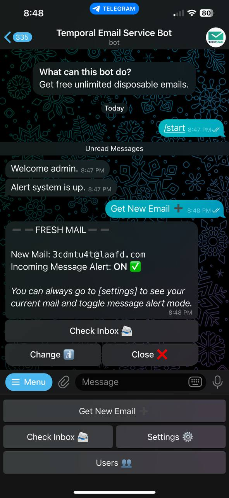

  <h1>TEMPORAL EMAIL SERVICE BOT 🤖</h1>
  

> I made this bot from the 1secmail API. Link to bot 👉 <a href='https://t.me/temp_email_service_bot'>Bot 🤖</a>

### Features

- Incoming Message Alert 💬

  > Emails generated within 30 mins will receive alert for any incoming message. Always generate new email when you are ready to use for this feature to work. This feature can be either turned on or off using the settings button
